# Bing-Input-Color

该 Fcitx5 主题设计思路源自Win10 2004更新后的自带的必应输入法界面，旨在模仿其简介、高雅又不失绚丽的设计风格。


## 使用方式

### 安装

#### For Arch Users: AUR安装

使用AUR助手下载安装：

```
yay -S fcitx5-bing-input-color
```

修改配置文件`~/.config/fcitx5/conf/classicui.conf`

```
# 垂直候选列表
Vertical Candidate List=False

# 按屏幕 DPI 使用
PerScreenDPI=True

# Font (设置成你喜欢的字体)
Font="思源黑体 CN Medium 13"

# 主题
Theme=Fcitx5-Bing-Input-Color
```

**修改配置文件时请先退出输入法，重启输入法后设置生效。**


#### 手动安装

创建文件夹：

```
mkdir -p ~/.local/share/fcitx5/themes/Fcitx5-Bing-Input-Color
```

克隆到本地：

```
git clone git@github.com:skykeyjoker/Fcitx5-Bing-Input-Color.git ~/.local/share/fcitx5/themes/Fcitx5-Bing-Input-Color
```

修改配置文件：`~/.config/fcitx5/conf/classicui.conf`

```
# 垂直候选列表
Vertical Candidate List=False

# 按屏幕 DPI 使用
PerScreenDPI=True

# Font (设置成你喜欢的字体)
Font="思源黑体 CN Medium 13"

# 主题
Theme=Fcitx5-Bing-Input-Color
```

**修改配置文件时请先退出输入法，重启输入法后设置生效。**

---

### 配置

#### 设置皮肤

本皮肤包自带多款皮肤，默认使用 *Sea-Foam-Green* 皮肤。

若要切换皮肤，请在皮肤文件夹下，将目标皮肤复制并重命名，覆盖 *highlight.png* 。

例如：

```shell
cp highlight-Blue-Green.png highlight.png
```

**皮肤修改后，重启输入法后修改生效。**


#### 使用单行模式

要使用单行模式( inline_preedit ),
对于 fcitx5自带 pinyin 请修改 `~/.config/fcitx5/conf/pinyin.conf`, 
加入/修改以下内容: 

```
#可用时在应用程序中显示预编辑文本
PreeditInApplication=True
```

**修改配置文件时请先退出输入法，重启输入法后设置生效。**

---

### 制作皮肤（需要一点 PS 基础）

在 Github 项目目录中保存了皮肤主要文件的PSD工程文件，可根据需求进行修改。

**注意：请不要擅自修改图片尺寸，否则将引起未知错误。**

**注意：请将图片保存为 PNG 格式，以保留图片透明通道，实现皮肤的透明效果。**

---

## 皮肤截图

### Blue-Green

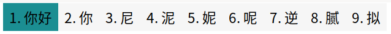

---

### Blue

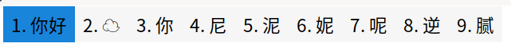

---

### Brick-Red

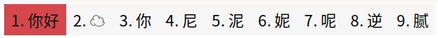

---

### Bright-Cool-Blue

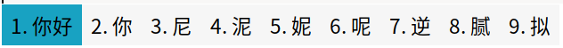

---

### Bright-Orange

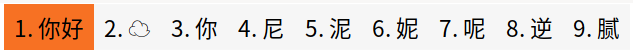

---

### Bright-Rose

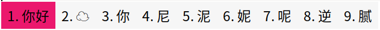

---

### Brilliant-Green

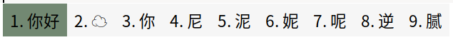

---

### Cool-Blue

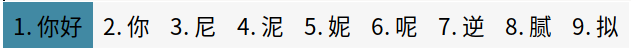

---

### Dark-Blue

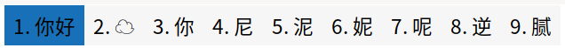

---

### Dark-Gray

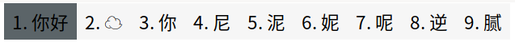

---

### Dark-Mint

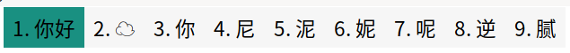

---

### Dark-Orange

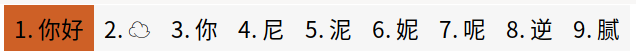

---

### Dark-Purple-Shade

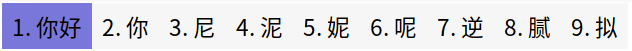

---

### Desert-Camouflage

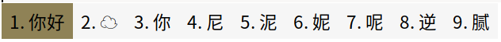

---

### Foggy-Gray


---

### Gold

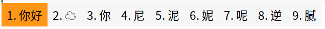

---

### Golden

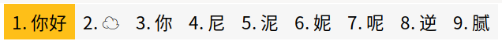

---

### Grass-Green

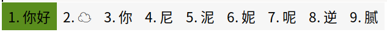

---

### Gray-Brown

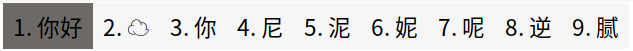

---

### Gray

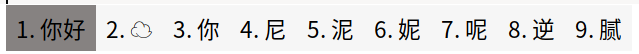

---

### Green

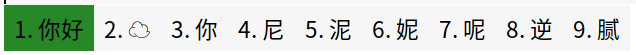

---

### Grey-Blue

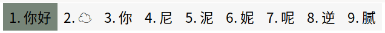

---

### Iris

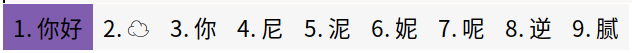

---

### Light-Gray

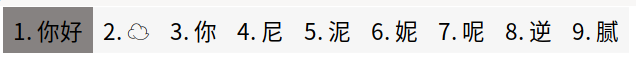

---

### Light-Green

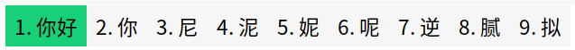

---

### Light-Mint

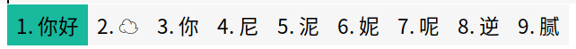

---

### Light-Moss

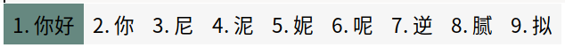

---

### Light-Orchid-Purple

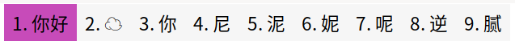

---

### Light-Purple-Red

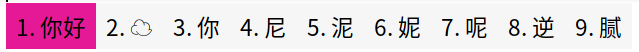

---

### Light-Purple


---

### Light-Red

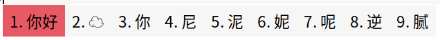

---

### Light-Rusty

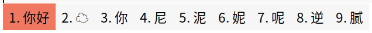

---

### Medium-Red


---

### Metallic-Blue

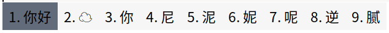

---

### Moss

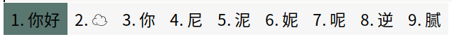

---

### Orchid-Purple

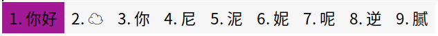

---

### Purple-Shade

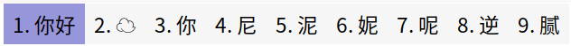

---

### Purple

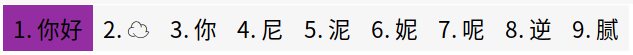

---

### Red

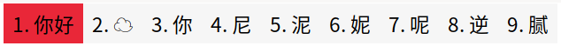

---

### Rose-Red

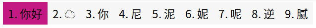

---

### Rose

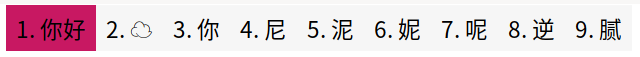

---

### Rusty

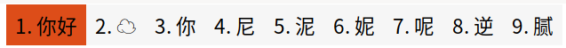

---

### Sage

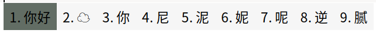

---

### Sea-Foam-Green

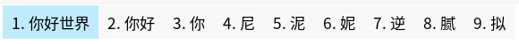

---

### Sky-Gray

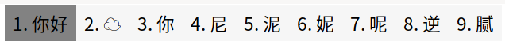

---

### Soft-Rainbow

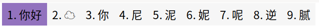

---

### Sports-Green


---

### Steel-Blue

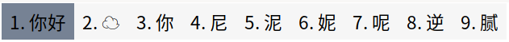

